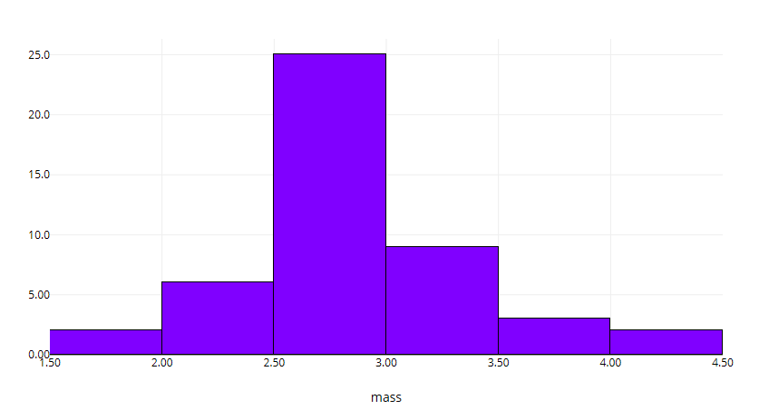

# Summary

This example demonstrates a histogram of data from Dakota's cantilever beam example problem.  The histogram plot was produced with Next-Gen Workflow (a tool provided in Dakota GUI) using an HDF5 dataset.

 
# Description

A cantilever beam can be thought of as a rigid structural element that extends horizontally and is supported at only one end.

The cantilever beam model has seven input parameters:

 - the length of the beam, **L**
 - the width of the beam, **w**
 - the thickness of the beam, **t**
 - Young's modulus, **E**
 - the density of the beam, **p**
 - the horizontal load on the beam, **X**
 - the vertical load on the beam, **Y**

The cantilever beam model produces three output responses:

 - the **mass** of the beam
 - the **stress** on the beam
 - the **displacement** of the beam

# Contents

- `Histogram.iwf` - a workflow file that extracts data from dakota_results.h5 and creates a histogram.
- `Histogram.plot` - a previously-generated plot file.  This plot is viewable in Dakota GUI.
- `dakota_results.h5` - The original HDF5 database file that contains the results of the Dakota study.

# How to run the example

- Open Dakota GUI.
- Import this example into your workspace.
- Double-click the Histogram.plot file to view the plot.

# How to create a new plot

- Open Dakota GUI.
- Import this example into your workspace.
- Double-click Histogram.iwf.
- Click on one of the two green play buttons in the action ribbon:

- The left play button allows you to define a custom location for running the workflow, while the right play button will run the workflow in the default location, which is a directory called "Histogram", located in the same parent directory as Histogram.iwf.
- After running, a new "Histogram" directory will be created, and a new "Histogram.plot" will be located inside.  Additionally, this workflow has been built to automatically open the new plot file as soon as it is generated.

# Further Reading

- [Read in the Dakota GUI manual about other types of plots that can be produced.](https://dakota.sandia.gov/content/chartreuse-1)
- [Read about how to produce HDF5 files using Dakota.](https://dakota.sandia.gov/content/hdf-0)
- [Read about histograms.](https://en.wikipedia.org/wiki/Histogram)
- To learn more about an individual node in Next-Gen Workflow, use the built-in help files by clicking on a node, then clicking on the question mark icon in the Settings Editor view.